# 🗃️ How Users Feed Personal Information into RAG Database

## 📥 **Current Data Collection Methods**

### **1. Automatic Data Collection (Passive)**
The system **automatically** collects user information during normal email scanning:

```python
# What gets collected automatically:
✅ Email scanning patterns and behavior
✅ Sender/contact relationships (from email headers)  
✅ Organization associations (from email domains)
✅ Response patterns to threats
✅ Scan history and results
✅ Time/usage patterns
```

### **2. Default Profile Creation**
When a new user first uses the system, it creates a **default profile**:

```python
default_profile = {
    'personal_info': {
        'age_group': 'unknown',
        'occupation': 'unknown', 
        'tech_savviness': 'medium',
        'primary_email_usage': 'personal'
    },
    'contacts': [],
    'organizations': [],
    'previous_scams': [],
    'risk_profile': {
        'overall_risk': 'medium',
        'susceptible_to': [],
        'awareness_level': 'medium'
    },
    'preferences': {
        'security_level': 'medium',
        'notification_frequency': 'normal'
    }
}
```

### **3. Missing: Manual Profile Setup** ❌
**Currently, there's NO direct way for users to manually enter personal information!**

The system lacks these important endpoints:
- `POST /api/user/{user_id}/profile` - Update personal info
- `POST /api/user/{user_id}/contacts` - Add known contacts  
- `POST /api/user/{user_id}/organizations` - Add trusted organizations
- `PUT /api/user/{user_id}/preferences` - Update security preferences

---

## 🔄 **What Happens After Layer 3 Analysis**

### **1. Finalization Process** (`finalize_scan_result`)
```python
def finalize_scan_result(scan_result, start_time):
    # Calculate processing time
    processing_time = (end_time - start_time).total_seconds()
    
    # Log the result
    logger.info(f"Scan completed: verdict={verdict}, confidence={confidence}")
    
    # Store in RAG database for history  
    rag_db.store_scan_result(scan_result)
    
    # Return result to Chrome extension
    return scan_result
```

### **2. Data Storage** 
**Multiple databases are updated:**

#### **A. Scan History Database**
```sql
INSERT INTO scan_history (
    scan_id, user_id, email_sender, email_subject,
    final_verdict, threat_level, confidence_score,
    layer1_status, layer2_status, layer3_status,
    processing_time, scan_timestamp
)
```

#### **B. Suspect Information Database** 
```sql
INSERT INTO suspect_info (
    sender_email, tactics_used, threat_level,
    target_demographics, email_metadata,
    first_seen, last_seen, frequency_count
)
```

#### **C. Conversation History**
```sql
INSERT INTO conversation_history (
    user_id, sender_email, subject, body_snippet,
    timestamp, sentiment, thread_id
)
```

#### **D. Layer 2 Training Database**
```sql
INSERT INTO training_data (
    email_text, predicted_label, predicted_confidence,
    actual_label, user_feedback, layer3_analysis
)
```

### **3. Response to Chrome Extension**
The complete scan result is returned to the browser extension:

```json
{
    "scan_id": "scan_20251003_102030_user123",
    "timestamp": "2025-10-03T10:20:30.123Z",
    "user_id": "user123", 
    "final_verdict": "threat",
    "threat_level": "high",
    "confidence_score": 0.92,
    "processing_time": 18.45,
    "layers": {
        "layer1": { "status": "clean", "confidence": 0.1 },
        "layer2": { "status": "suspicious", "confidence": 0.75 },
        "layer3": { 
            "verdict": "threat",
            "social_engineering_score": 87,
            "tactics_identified": ["Authority Impersonation", "Urgency Manufacturing"],
            "detailed_analysis": "Sophisticated CEO fraud attempt...",
            "recommended_action": "DO NOT INTERACT. Report immediately."
        }
    }
}
```

### **4. Chrome Extension Actions**
Based on the Layer 3 result:

#### **🚨 If THREAT Detected:**
```javascript
// Show immediate blocking overlay
showThreatBlockingOverlay(scanResult);

// Add visual warnings to email interface  
markEmailAsDangerous(emailElement);

// Show detailed threat analysis
displayThreatDetails(scanResult.layers.layer3);

// Update scan statistics
updateThreatCounter();
```

#### **⚠️ If SUSPICIOUS:**
```javascript
// Show warning banner
showSuspiciousWarning(scanResult);

// Highlight risky elements
highlightSuspiciousElements(emailElement);

// Provide user education
showSecurityTips(scanResult.layers.layer3.tactics_identified);
```

#### **✅ If SAFE:**
```javascript
// Show green checkmark (brief)
showSafeIndicator();

// Log for statistics only
updateScanCounter();

// No blocking or warnings
```

### **5. User Feedback Collection**
After the user takes action:

```javascript
// If user clicks "Report as Safe" or "This is Spam"
await fetch('/api/feedback', {
    method: 'POST',
    body: JSON.stringify({
        scan_id: scanResult.scan_id,
        user_verdict: 'false_positive', // or 'confirmed_threat'
        scan_results: scanResult,
        user_action: 'marked_safe'
    })
});
```

### **6. Machine Learning Pipeline**
The feedback triggers model improvement:

```python
# Layer 2 model learns from corrections
layer2.store_feedback({
    'email_metadata': email_data,
    'predicted_label': scan_result.layers.layer2.predicted_label, 
    'actual_label': user_feedback.corrected_label,
    'confidence_gap': confidence_difference
})

# Update model performance metrics
layer2.update_performance_metrics()

# Flag for potential retraining
if accuracy_drop_detected():
    schedule_model_retraining()
```

---

## 🔄 **Complete Workflow Summary**

```mermaid
graph TD
    A[📧 Email Scanned] --> B[🔍 Layer 1-3 Analysis]
    B --> C[📊 Layer 3 Final Verdict]
    C --> D[💾 Store in RAG Database]
    D --> E[📱 Send to Chrome Extension]
    E --> F[🛡️ Apply Security Action]
    F --> G[👤 User Takes Action]
    G --> H[📝 Collect Feedback]
    H --> I[🤖 ML Pipeline Learning]
    I --> J[📈 Improve Future Scans]
    
    C --> K[🔒 Update Threat Intelligence]
    C --> L[📈 Update User Risk Profile]
    C --> M[💬 Monitor Conversations]
```



---

## ❌ **Current Limitations & Missing Features**

### **User Profile Management:**
1. **No manual profile setup interface**
2. **No contact import functionality** 
3. **No organization trust list management**
4. **No personal vulnerability assessment**

### **Recommended Additions:**
```python
# Missing API endpoints that should be added:
POST /api/user/{user_id}/profile          # Set personal info
POST /api/user/{user_id}/contacts         # Import contacts  
POST /api/user/{user_id}/organizations    # Add trusted orgs
PUT  /api/user/{user_id}/preferences      # Security settings
GET  /api/user/{user_id}/risk-assessment  # Vulnerability analysis
```

The system **learns about you over time** through your email patterns, but it **lacks manual profile setup** that would make Layer 3 analysis much more accurate and personalized! 🎯